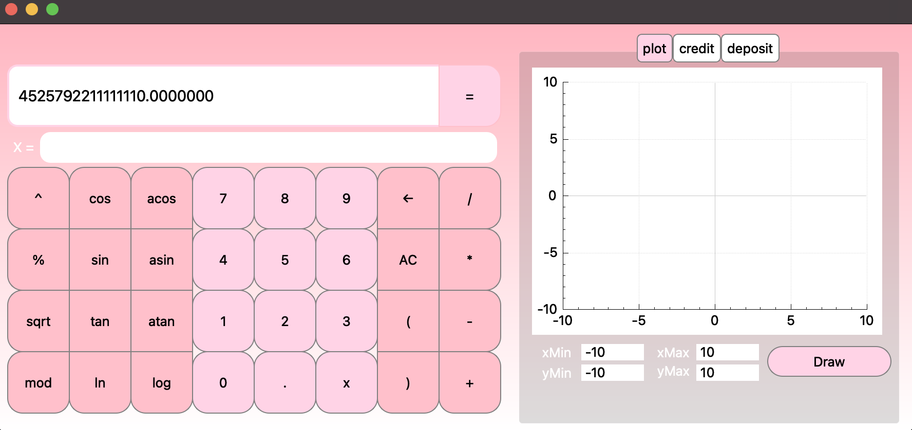

## Отчет по заданию "C7_SmartCalc_v1.0-1":

1) [Условия реализации SmartCalc v1.0](#part-1-условия-реализация-SmartCalc-v1.0)
2) [Реализация SmartCalc v1.0.](#part-2-реализация-SmartCalc-v1.0)
3) [Сборка](#part-3-сборка)
4) [Кредитный калькулятор](#part-4-кредитный-калькулятор)
5) [rcn]

## Part 1. Условия реализации SmartCalc v1.0.
1) Программа должна быть разработана на языке Си стандарта C11 с использованием компилятора gcc. Допустимо использование дополнительных библиотек и модулей QT
2) Код программы должен находиться в папке src
Сборка программы должна быть настроена с помощью Makefile со стандартным набором целей для GNU-программ: all, install, uninstall, clean, dvi, dist, test, gcov_report. Установка должна вестись в любой другой произвольный каталог
3) Программа должна быть разработана в соответствии с принципами структурного программирования
4) При написании кода необходимо придерживаться Google Style
5) Должно быть обеспечено покрытие unit-тестами модулей, связанных с вычислением выражений, с помощью библиотеки Check
6) Реализация с графическим пользовательским интерфейсом, на базе любой GUI-библиотеки с API для C89/C99/C11
Для Linux: GTK+, CEF, Qt
Для Mac: GTK+, Nuklear, raygui, microui, libagar, libui, IUP, LCUI, CEF, Qt
7) На вход программы могут подаваться как целые числа, так и вещественные числа, записанные через точку. По желанию можно обрабатывать ввод чисел в экспоненциальной записи
8) Вычисление должно производиться после полного ввода вычисляемого выражения и нажатия на символ =
9) Вычисление произвольных скобочных арифметических выражений в инфиксной нотации
10) Вычисление произвольных скобочных арифметических выражений в инфиксной нотации с подстановкой значения переменной x в виде числа
11) Построение графика функции, заданной с помощью выражения в инфиксной нотации с переменной x  (с координатными осями, отметкой используемого масштаба и сеткой с адаптивным шагом)
12) Не требуется предоставлять пользователю возможность менять масштаб
13) Область определения и область значения функций ограничиваются по крайней мере числами от -1000000 до 1000000
14) Для построения графиков функции необходимо дополнительно указывать отображаемые область определения и область значения
15) Проверяемая точность дробной части - минимум 7 знаков после запятой
У пользователя должна быть возможность ввода до 255 символов

## Part 2. Реализация SmartCalc v1.0.




1) Программа разработана на языке Си, стандарта С11, и находится в папке src.
    
2) В сборке программы используются цели:

    \-
    all/install: собирает весь проект.

    \-
    uninstall: удаляет сборку

    \-
    obj/%.o
    gcov_obj/%.o: Эти цели компилируют объектные файлы из исходных файлов в соответствующих директориях (obj и gcov_obj)

    \-
    smart_calc_gcov.a: Создают статические библиотеки smart_calc.a и smart_calc_gcov.a из объектных файлов.

    \-
    test: Компилирует тестовый исполняемый файл из объектных файлов тестов 

    \-
    clean: для очистки временных и созданных файлов. Удаляются директории ../build, ../dist, а также файлы, связанные с измерением покрытия кода 

    \-
    dvi: открывает отчет.

    \-
    dist: //для создания дистрибутивного архива программы, распространение и развертывание, сжатие и архивация 
    \-
    test: запускает тесты.

    \-
    gcov_report: открывает отчет по покрытию файлов тестами.

    \-
    style: подгоняет под код программы стандарты Google, и проверяет логику в коде. 

    \-
    cool_test: объединяет цели clean, test и gcov_report, чтобы автоматизировать выполнение очистки, запуска тестов и создания отчета по покрытию кода.

    \-
    clang: Эта цель используется для форматирования кода с использованием clang-format. Она применяет форматирование к файлам с расширением .c, .h

    \-
    cppcheck: //статического анализа кода с использованием cppcheck. 

    \-
    valgrind: //для обнаружения утечек памяти и других проблем. Она подразумевает, что цель test предварительно собирает и запускает модульные тесты.
    
    \-
    leaks: проверяет результаты тестов на утечки памяти.

3) Покрытие unit-тестами 


4) Реализация графического пользовательского интерфейса на базе Qt.

На фронтенде реализовано взаимодействие с пользователем через графический интерфейс, созданный с использованием библиотеки Qt. Когда пользователь нажимает на кнопку с цифрой или оператором, соответствующий слот (метод) класса MainWindow вызывается для обработки события. Методы, такие как digit_numbers(), operators(), и function(), изменяют текущий текст в поле вывода (ui->result_show) в соответствии с действиями пользователя. Таким образом, фронтенд отвечает за обработку ввода пользователя и отображение результатов на графическом интерфейсе.

Например, благодаря функции connect(), сигнал clicked() от кнопок связывается с методами класса, такими как digit_numbers(), operators(), и function(). Когда пользователь нажимает на кнопку, генерируется соответствующий сигнал clicked(), который запускает соответствующий метод, обеспечивая обработку событий в реальном времени.

```
typedef struct Stack {
  long double value;  
  struct Stack *top;  
                      
} Stack;
```

5) Вычисления производятся Алгоритмом Дейкстры. 

Для построения калькулятора используется стек, который представлен структурой данных "односвязный список". Структура Stack содержит два поля: value, предназначенное для хранения значения элемента стека, и top, который является указателем на предыдущий элемент в стеке, реализуя таким образом односвязный список.

Функции push, pop, peek, и destroy предоставляют операции добавления элемента в стек, извлечения верхнего элемента, получения значения верхнего элемента и освобождения памяти соответственно.

Такая реализация стека может быть использована в калькуляторе для обработки операндов и операторов, например, при вычислении выражения в обратной польской записи, которая может быть построена с использованием алгоритма Дейкстры.
     

6) Построение графика функции реализовано с помощью библиотеки customplot.h

    По заданию область определения и область значения функций ограничиваются по крайней мере числами от -1000000 до 1000000, по умолчанию установлены значения -10 и 10. 

 


## Part 3. Сборка.

1) В сборке программы используются цели:

     \-
    install: собирает весь проект.

    \-
    leaks: проверяет результаты тестов на утечки памяти.

    \-
    uninstall: удаляет сборку.

    \-
    clean: очищает проект.

    \-
    dvi: открывает отчет.

    \-
    test: запускает тесты.

    \-
    gcov_report: открывает отчет по покрытию файлов тестами.

    \-
    style: подгоняет под код программы стандарты Google, и проверяет логику в коде. 


2) При сборке на рабочем столе появится папка, в которой будет находиться ярлык программы.


## Part 4. Кредитный калькулятор.

1) на вход принемается: 
    1. Общая сумма кредита.
    2. Срок, процентная ставка.
    3. Тип (аннуитетный, дифференцированный).
    
2) выводится: 
    1. Ежемесячный платеж.
    2. Переплата по кредиту.
    3. Общая выплата.
    
   -  В программе Дифференцированный платеж выводится за первый месяц и последний месяц (просмотреть можно через прокрутку колесика). 


### Part 5. Депозитный калькулятор.

1) на вход принемается: 
    1. сумма вклада
    2. срок размещения
    3. процентная ставка
    4. налоговая ставка
    5. периодичность выплат
    6. капитализация процентов
    7. список пополнений
    8. список частичных снятий
2) выводится: 
    1. начисленные проценты
    2. сумма налога
    3. сумма на вкладе к концу срока

    

